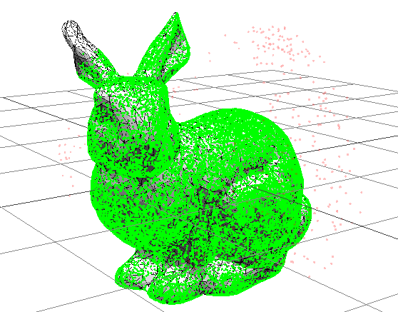
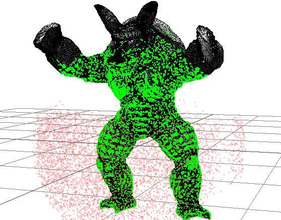
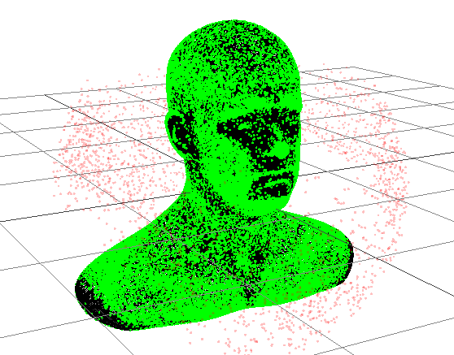
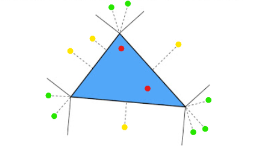

# Closest Point Query
|      bunny.obj      |      armadillo.obj      |      head.obj      |
| :-----------------: | :---------------------: | :----------------: |
|  |  |  |

## Table of Contents
- [Benchmarks](#benchmarks-bar_chart)
- [Build Project](#build-project-hammer)
- [Visualizer](#visualizer-art)
- [Development Log](#development-log-card_file_box)
- [Methodology](#methodology-scroll)
- [Assumptions](#assumptions-bangbang)
- [Possible Improvement](#possible-improvement-bulb)
- [Dependencies](#dependencies-books)

## Benchmarks :bar_chart:
Running on an Intel(R) Core(TM) i5-9400F, release build, multi-threaded. All query points are generated randomly within a 1.5x unit sphere and 0.5 maximum query distance. 

Models downloaded from Morgan McGuire's [Computer Graphics Archive](https://casual-effects.com/data)

**Using [nushoin/RTree](https://github.com/nushoin/RTree)**
| Model Name    | Triangles | Query Points | R-Tree Construct Time | Execution Time |
| :------------ | :-------- | :----------- | :-------------------- | :------------- |
| bunny.obj     | 5,002     | 100,000      | 0.007s                | 0.451s         |
| armadillo.obj | 212,574   | 100,000      | 0.396s                | 17.183s        |
| head.obj      | 1,131,776 | 100,000      | 2.282s                | 86.719s        |

**Using own implementation of the R\*-tree**
| Model Name    | Triangles | Query Points | R-Tree Construct Time | Execution Time      |
| :------------ | :-------- | :----------- | :-------------------- | :------------------ |
| bunny.obj     | 5,002     | 100,000      | 0.076s  / 0.075s*    | 0.412s / 0.395s*   |
| armadillo.obj | 212,574   | 100,000      | 4.437s  / 4.189s*    | 15.678s / 14.966s* |
| head.obj      | 1,131,776 | 100,000      | 17.426s / 16.262s*   | 65.440s / 64.101s* |

\* Using own SIMD implementation of `Vec3`

## Build Project :hammer:
This project uses third-party libraries as git submodules. Make sure to update and init them:
```sh
git submodule update --init
```

I'm using [premake5](https://premake.github.io/) for solution/project generation. The executable is already included, you may simply run:
```sh
premake5.exe vs2019
```
**Note:** If you're not using Visual Studio 2019, see [here](https://premake.github.io/docs/Using-Premake#using-premake-to-generate-project-files) for more options.

Now you can build the project with the generated project file.

## Visualizer :art:
To launch the visualizer, you must have the file `query_points.csv` that is generated by the example program. You can define `VISUALIZER_OUTPUT` to generate one. For detailed layout of the CSV file, please see the implementation in `ClosestPointOnMesh.cpp`.

Due to the security concern on COR request, most browser won't let you access local resources if you directly open the html file. To view the page, you'll have to host your own local server. One of the simplest ways is using `http.server` if you have Python installed.
```python
python -m http.server
```

## Development Log :card_file_box:
- 2021-6-24
  - Gather libraries for kick starting the project.
  - Created `Mesh`, `Point`, `Triangle` class and successfully load an OBJ model.
- 2021-6-25 
  - Created a three.js visualizer for displaying results stored in CSV format.
  - Implemented the core algorithm for finding the closest point on a mesh.
- 2021-6-26
  - Using `std::async` and `std::future` to utilitize multi-core CPU computation.
  - Writing unit tests using GoogleTest. 
- 2021-6-27
  - Finalize solution structure, made an example project for benchmarking.
  - Conclude initial findings and documentations.
- 2021-7-3
  - Potential bugs fixed, revised some namings.
  - Added two more test cases when no closest point is found.
  - Tweaked R-Tree node and async task size.
- 2021-7-11
  - Implemented R*-tree as the acceleration structure, trading better query performance with a longer tree construction time.
  - Removed [nushoin/RTree](https://github.com/nushoin/RTree) library.

## Methodology :scroll:
Finding the closest point on a given mesh is equivalent to breaking down the subproblem of finding the closest points to every single triangles. We have to manifest an efficient spatial structure for getting region of interest (ROI). I used an R-Tree approach to store triangles in a mesh. After searching for possible candidates within the search distance, iterate through all candidates and find the closest point from the query point to the triangle. 

To find the closest point to a triangle, for each triangle:


1. Calculate the normal of the triangle. (Right hand rule, counter-clockwise)
2. Find the projection from the query point onto the triangle's plane. 
3. Since the shortest possible length is the calculated orthogonal projection, we can rule out this triangle if the distance to plane is larger than the shortest distance we've found.
4. Else, the next closest point must be in one of these locations: lying on the edges (green), exactly on its vertices (yellow), or within the triangle itself (red).
5. To determine which case, we can check the number of edges it was considered "outside". This can be done by comparing the winding order with the different in direction of their cross products. 
6. Noted that a point can only be "outside" of at most two edges. And in that case, the closest point is on one of the vertices (green).
7. If the point is "outside" for only one edge, it obviously lies on the edge (yellow). Just make a projection on the edge and that's the closest point.
8. Or else, the projected point is already within the triangle itself. It's already the closest point on the triangle.
9. Repeat the above steps until all candidates are compared with the best closest point. 

## Assumptions :bangbang:
- All faces must be triangulated.
- Triangles in a mesh are static, meaning the mesh won't be modified during runtime.
- Currently only support querying multiple points on a single mesh.

## Possible Improvement :bulb:
- The current R*-tree implementation still exhibit overlaps among bounding boxes. Perhaps a better partitioning method can be adopted.
- To enable query on multiple meshes, we can use other BVH to eliminate objects in a larger scale.
- Use/develop a better SIMD mathematics library that supports platform/hardware acceleration.
- `std::function` was used in the R-Tree library and it's notorious for performance trade off. I'd suggest rewrite one with function pointers.
- Implement the 2D method for calculating distance from a point to a triangle suggested by [this paper](http://citeseerx.ist.psu.edu/viewdoc/download?doi=10.1.1.104.4264&rep=rep1&type=pdf) by Mark W. Jones. By pre-computing matrices to transform triangles to align with axes and origin rather than performing vector maths. This method claiming to be 3-4 times faster than the 3D approach.

## Dependencies :books:
- [premake5](https://github.com/premake/premake-core) - for solution/project generation
- [glm](https://github.com/g-truc/glm) - for linear algebra calculation
- [googletest](https://github.com/google/googletest) - [prebuilt binary] for unit testing
- [tinyobjloader](https://github.com/tinyobjloader/tinyobjloader) - for loading OBJ file
- [three.js](https://github.com/mrdoob/three.js/) - for visualizing the results